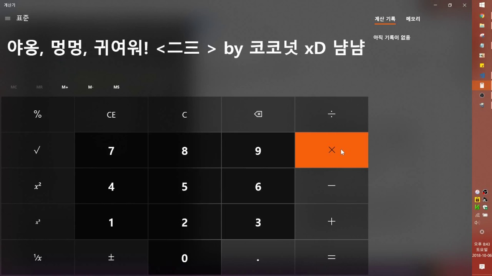

# hookwin10calc

- Runtime module (DLL) that hooks functionality of `Calculator.exe`, with help of [gominhook](https://github.com/NaniteFactory/gominhook).

- Reverse engineering UWP `Calculator.exe` in Windows 10.

- - -

### Build

```Bash
$ make build
```

### Clean-up

```Bash
$ make clean
```

- - -

## Demo




